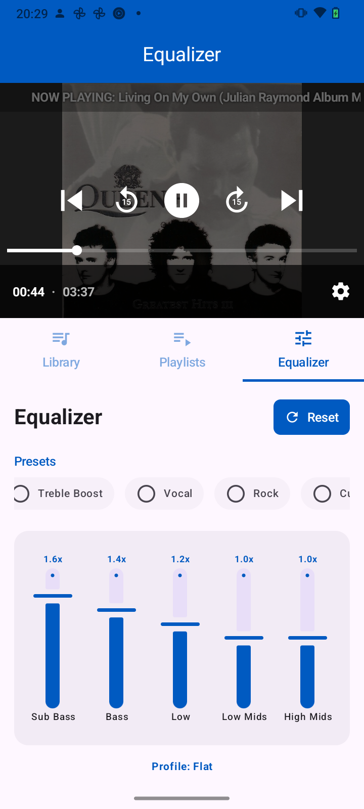
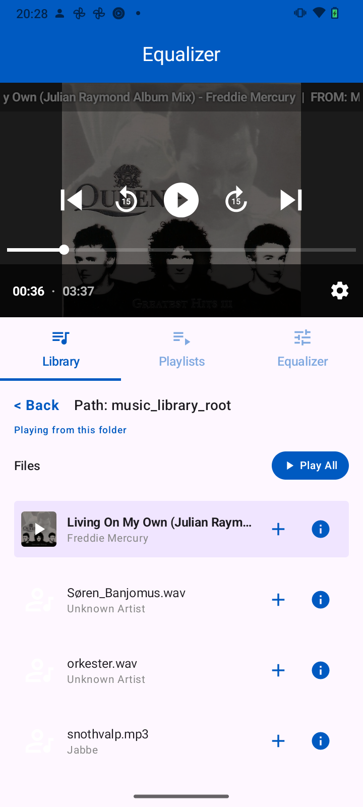
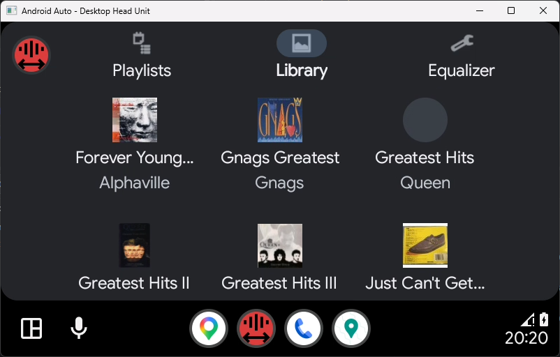
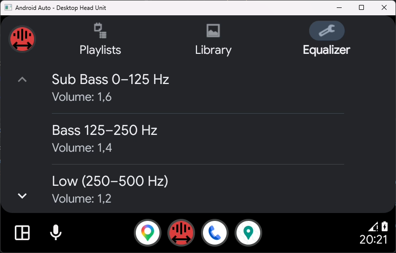

# My Media Player

A high-performance Android Media Player featuring a custom C++ audio engine, 8-band parametric equalizer, and comprehensive Android Auto support.

## 🚀 Key Features

*   **Custom C++ Audio Engine**: Powered by Oboe and JUCE for low-latency, high-fidelity audio playback.
*   **8-Band Parametric Equalizer**: Real-time frequency adjustment with built-in presets (Bass Boost, Vocal, Rock, etc.).
*   **Intelligent Android Auto Integration**:
    *   **Modern Mode**: Fully featured tab-based UI for modern head units (API 6+).
    *   **Legacy Mode**: Simplified list-based UI for older infotainment systems (API 1-5).
    *   **Dashboard Sync**: Complete synchronization with the standard Android Auto media dashboard.
*   **Smart Artwork Caching**: Persistent disk and memory caching for near-instant loading of album art.
*   **High Performance**: Native file reading and processing to minimize CPU and battery usage.
*   **Robust Metadata Support**: Handles MP3, M4A, and WAV formats with advanced ID3 tag parsing.

## 📸 Screenshots

### Mobile App
<p align="center">
  
  
</p>

### Android Auto
<p align="center">
  
  
</p>

## 🛠 Tech Stack

*   **Kotlin**: Main application logic and UI.
*   **Jetpack Compose**: Modern, reactive user interface for the phone app.
*   **C++ (NDK)**: High-performance audio processing engine.
*   **Oboe**: High-performance audio library for Android.
*   **JUCE**: Audio format reading and processing.
*   **Media3 (ExoPlayer)**: Media session management and notification handling.
*   **Car App Library**: Multi-level Android Auto support.

## 📦 Project Structure

*   `:app`: The main mobile application module (Jetpack Compose).
*   `:common`: Shared business logic, metadata parsing, and the native C++ engine.
*   `:carservice`: Android Auto service and template-based UI implementation.

## 🛠 Building

The project uses the standard Gradle build system. Ensure you have the **Android NDK** and **CMake** installed for compiling the native audio engine.

```bash
# Build Debug APK
./gradlew :app:assembleDebug

# Build Release APK
./gradlew :app:assembleRelease
```

*Note: The Release build uses a blue icon background for easy distinction from the Debug version (Red).*

## 📄 License

This project is licensed under the Apache License 2.0.
